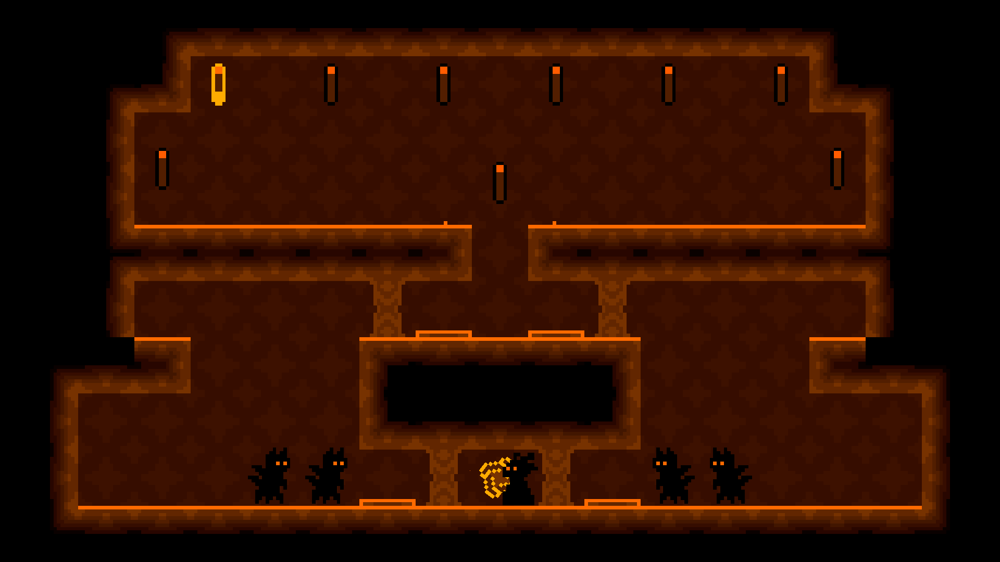
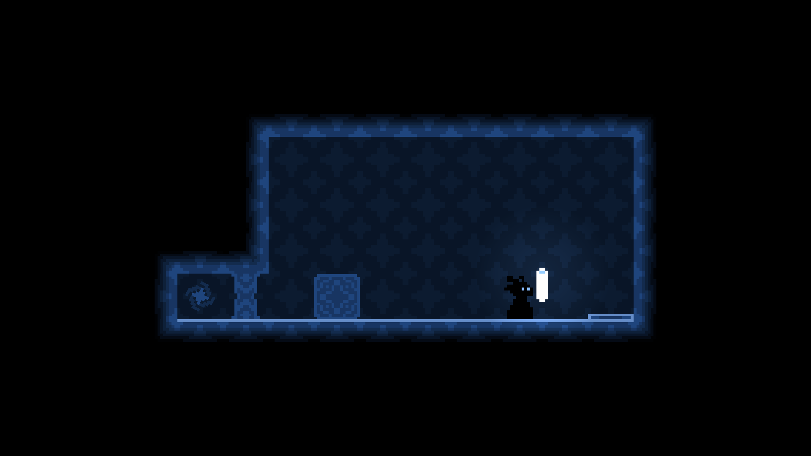

# LightAdventure
Nine unique puzzle levels are available, including wave survival, a boss fight, and a level unlock system. I implemented the main menu, an in-game menu, SFX/music management, and animations.

To survive, you must stay in the light. Light activations are temporary, so you’ll need to move quickly or stay close to the source. During your exploration, you’ll encounter mysterious creatures that can be ignited by shooting a projectile through a torch. These creatures try to steal your privilege. Defeat the boss to rescue them!

# Instructions
Extract .zip and double click .exe

# Images
<table>
	
  <tr>
  	<td></td>
    <td></td>
    <td></td>
  </tr>
</table>